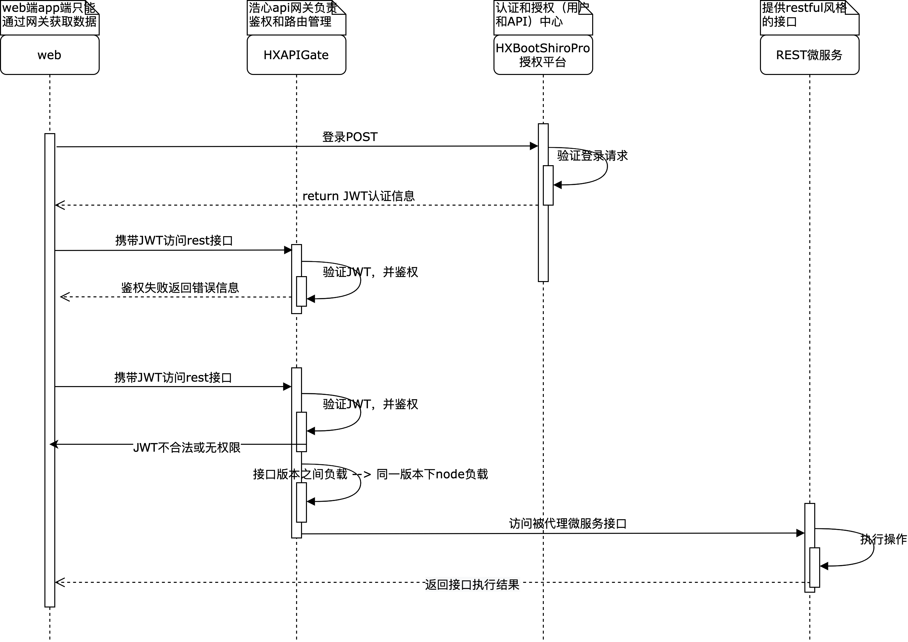
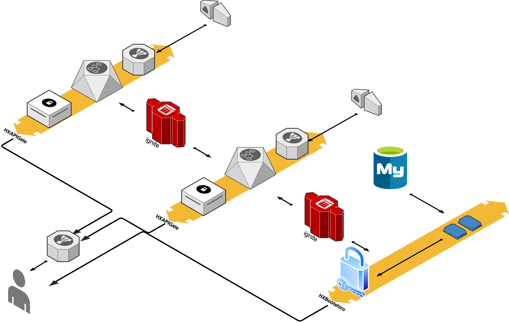
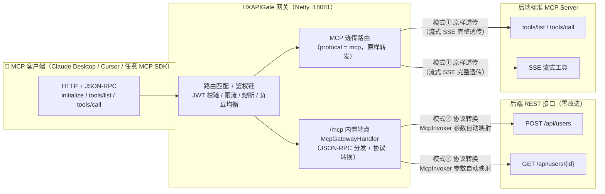
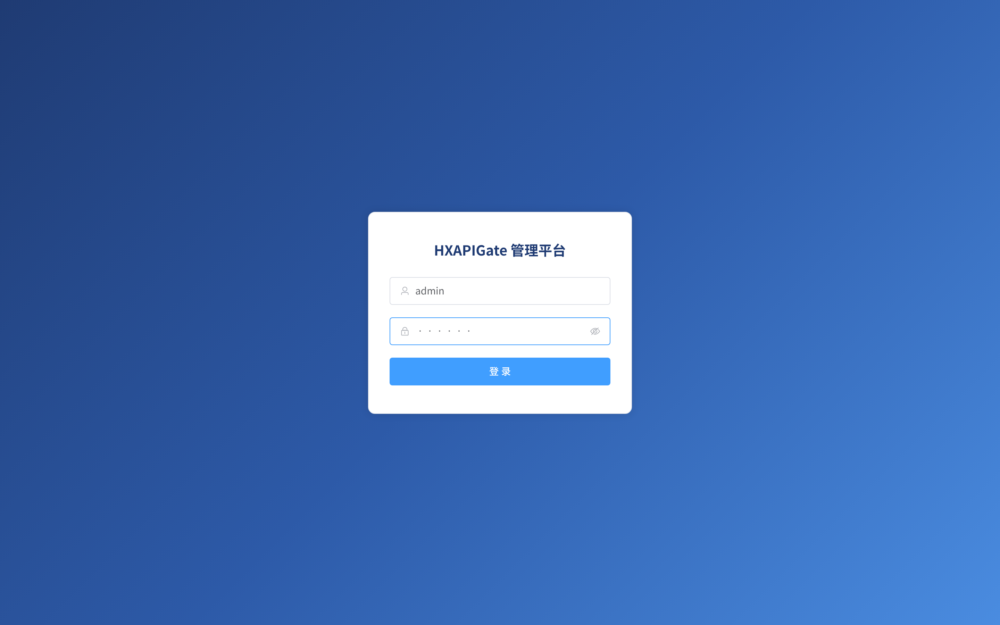
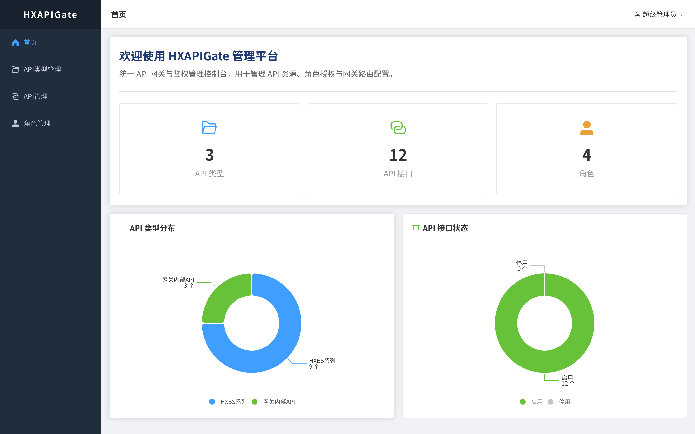
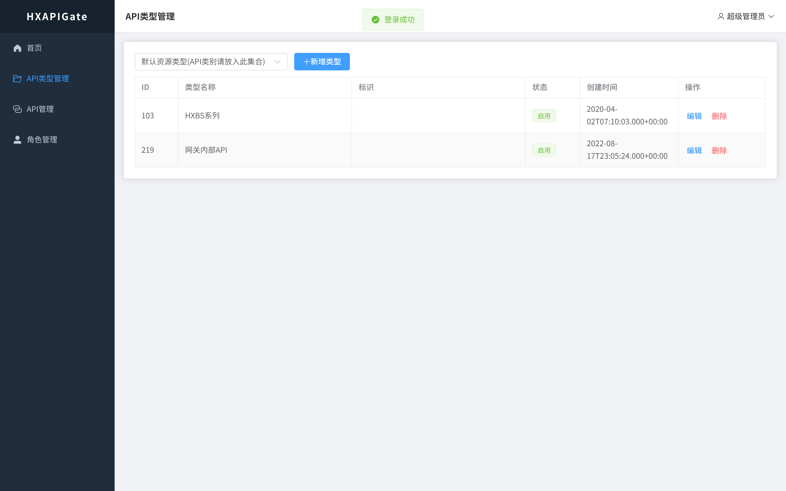
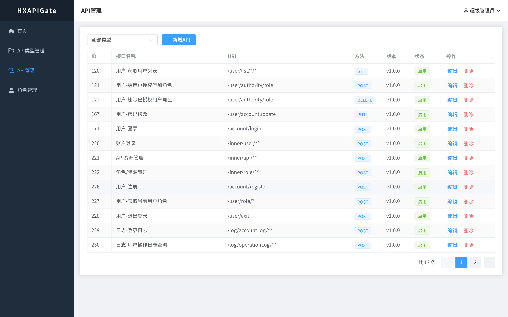
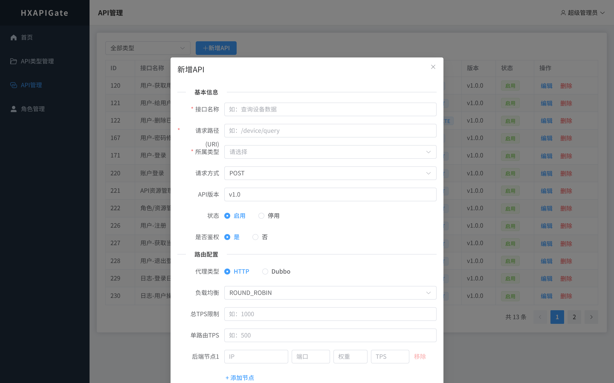
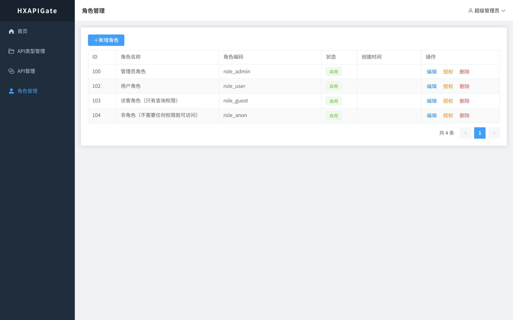
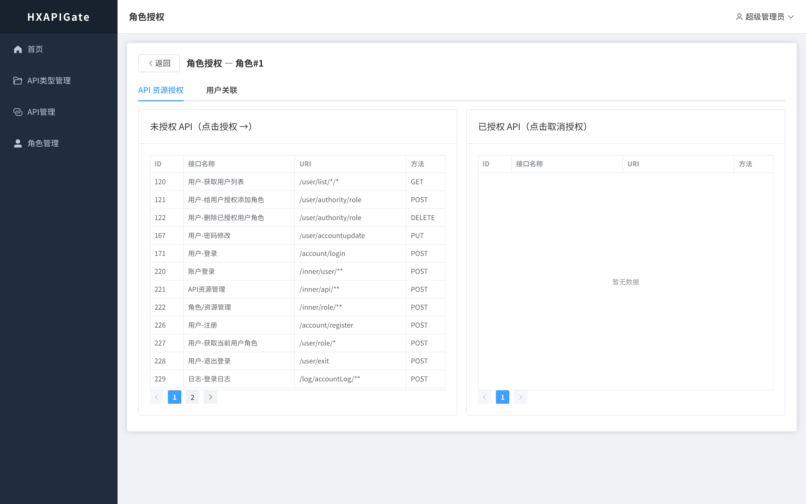

## 简介
### 更新说明
- 当前：
    1. 安全加固：JWT 签名密钥外置化（环境变量 `HXAPI_JWT_SECRET` 注入，管理端与网关共用）、数据库口令环境变量化
    2. 死代码清理：移除 5 个无调用接口（/account/login、/inner/api/islogin、/inner/api/initApiList、/inner/api/initApiByItemIdAndRID、/inner/role/getMenusByRoleId 等）及对应 Service/Mapper 层
    3. 前端 Vue3 + Element Plus 全面改造（登录页粒子动画、API 两级类型、角色授权双栏等）
    4. JDK21 + Shiro 3.0 + jjwt 0.12 升级，移除 Ignite 依赖
    5. 增加接口熔断功能，同时对新增接口的路由信息增加安全限制保障服务运行安全等

### 概念
HXAPIGate（中文名：浩心API网关）——如果觉得可以请star本项目。
HXAPIGate基于Netty+Shiro开发的一款高性能API网关，对基于REST服务的细粒度API资源的权限管理平台，支持http,dubbo等多协议微服务接口代理。**——本软件著作权归原作者所有**


### 软件特色

目前多数授权管理平台都只单单对api路径资源本身授权，而不能做到更细粒度的权限控制，HXAPIGate通过组合bootshiroPro实现了对“api资源+请求方式”的授权模式。
如：
新增如下四个接口

| 接口路径 | 请求方式 |
|--|--|
|“/user/list”| GET |
|“/user/list”| POST |
|“/user/list”| DELETE |
|“/user/list”| PUT |

传统授权模式下，这四个接口会被当做一个接口（因为接口路径一致）授权给第三方，**而通过HXAPIGate可分别对每个资源进行授权，当仅仅授权“/user/list”+“GET”给第三方平台时，被授权放无法访问同一资源的POST、DELETE、PUT请求当时的接口！**


### MECHA--机甲

浩心网关是微服务思想结合mecha 思想落地的产物。如下图所示，描述微服务与浩心网关的关系，内部浅绿色区域为业务相关微服务区，浩心网关所在区域为外部分布式特性区域，
由图可知，微服务不需要考虑任何分布式特性，更不需要在服务的生命周期中引入与业务功能不相关的任何第三方分
布式组件特性（典型如spring cloud全家桶），当一个业务微服务单元发布之后，浩心网关会直接赋予该服务所有分
布式组件特性。当然大家如果了解过service mesh，就会发现与其有神似之处，未来将浩心网关打造成一款工业级sidecar,
也是我希望的能够达到的目标之一。


### 为什么不选择springCloud or dubbo
- 不选择springcloud的原因很简单，除非贵公司项目全是新上马的项目，没有任何历史遗留问题——就算果真如此，在某些情况下也不建议使用springCloud（springCloud的学习成本等因素）--不选择
springCloud的原因就是因为考虑到很多公司遗留的一些历史问题，无法改用springCloud,但是如果在无法改用dubbo或者springCloud却想在不更改或者极少更改的情况下实现微服务的分布式限流、服务熔断等
分布式服务特性，那么恭喜您，HXAPIGate的目的正是如此。
- 不选择dubbo的原因，首先HXAPIGate其实是兼容了dubbo协议的，用户侧目前统一为HTTP协议，因此虽然API网关本身不对外提供dubbo服务对外服务，但是可以代理dubbo微服务，同时也可以实现对dubbo的分布式限流。


## 项目文档
项目文档请参加项目的Wiki，里面会介绍项目的使用方法已经路由的配置方法等信息。如果觉得项目不错，别忘了给个star！谢谢！


### 授权认证时序图


### 性能
2000并发事务压测报告（jdk1.8，jvm堆内存512M）


### 网关部署结构
HXAPIGate支持集群部署，支持被代理接口的分布式限流、负载等。分布式部署时网关节点通过 Redis 进行分布式限流与配置同步，管理平台（HXBootShiro）负责 API 路由与鉴权规则的统一管理（已移除对 Ignite 的依赖）。


### MCP 协议转换网关架构

HXAPIGate 内置 MCP（Model Context Protocol）支持，提供两种接入模式：

- **模式①：MCP 透传**——协议类型选择 `MCP`，网关将 MCP 客户端的 JSON-RPC 请求**原样转发**给后端标准 MCP Server，网关仅承担鉴权/限流/熔断/负载均衡（后端必须自己实现 MCP 协议）。
- **模式②：HTTP 接口映射为 MCP**——协议类型保持 `HTTP` 并勾选「暴露为MCP工具」，网关内置 `/mcp` 端点将 MCP JSON-RPC **协议转换**为 HTTP 请求（路径参数→URL、其余参数 POST 拼 JSON body / GET 拼 query），后端普通 REST 接口**零改造**即可被 MCP 客户端发现与调用。



| 维度 | 模式①：MCP 透传 | 模式②：HTTP 接口映射为 MCP |
|---|---|---|
| 路由协议类型 | `MCP` | `HTTP` + 「暴露为MCP工具」开关 |
| 后端要求 | 本身就是标准 MCP Server（MCP SDK 实现） | 普通 REST 接口，零改造 |
| 网关动作 | 原样转发（不解析协议） | 协议转换：MCP JSON-RPC ⇄ HTTP |
| 工具清单来源 | 后端自行管理 | 网关从 Redis 路由自动生成 tools/list |
| 典型场景 | 已有 MCP Server 统一收口到网关 | 存量 REST API 资产暴露给 AI 客户端 |


## 本地启动

### 环境依赖
- **JDK 21**（网关与管理端均要求）
- **MySQL**（默认 127.0.0.1:13306，库名 `hxapigate`，脚本 `HXBootShiro/hxapigatev2.0.sql`）
- **Redis**（默认 127.0.0.1:6379，路由缓存与分布式限流）

### 1. 启动管理端（HXBootShiro）
```bash
mvn -f HXBootShiro/pom.xml package -DskipTests   # 首次需打包
./start_bootshiro.sh
```
- 管理平台地址：http://localhost:18080/static/index.html
- 默认账号：`admin / 123456`

### 2. 启动网关（HXAPIGate）
```bash
mvn -f HXAPIGate/pom.xml package -DskipTests      # 首次需打包
./start_gateway.sh
```
- 网关启动后自动从 Redis 拉取管理端下发的 API 路由与熔断/限流配置

### 环境变量（可选）
| 变量 | 说明 |
|---|---|
| `HXAPI_JWT_SECRET` | JWT 签名密钥，**生产环境务必设置强随机值**，管理端与网关必须一致；本地开发可写入 `~/.hxapigate_jwt_secret` |
| `HXAPI_DB_USERNAME` / `HXAPI_DB_PASSWORD` | 数据库凭据（默认取 application.yml dev 配置） |

## 操作演示

### 登录（用户名密码为：admin/123456）


### 首页


### 接口类型管理
接口类型管理==项目管理，是一类API接口的集合，支持两级结构（父类型 + 子类型）



### 接口管理
管理API接口，对API接口的基本信息（路由、负载策略、协议类型等等）进行管理


新增接口功能截图：


### 角色管理


### 接口授权
以角色为桥梁，分别对用户、API接口进行授权


### 目前网关已实现功能
1. 授权、鉴权管理（JWT 密钥支持环境变量外置注入）
2. 路由配置（支持熔断参数 UI 可视化配置：失败阈值/成功阈值/超时毫秒）
3. 路由负载（轮询和赋权值）
4. HTTP、dubbo多协议协议
5. 接口分布式限流（Redis 计数信号量）
6. 金丝雀发布
7. 接口熔断（状态机管理，配置值优先于 TPS 自动推导）
8. 管理平台首页统计（ECharts 类型分布/接口状态图表）
9. 网关核心单元测试（限流/负载均衡/熔断状态机）

### 项目进度
目前HXAPIGate网关对API接口的管理已经基本开发完成，后续主要对API接口支持代理的协议以及网关bug进行扩展和完善
同时将对管理平台的功能进行扩展，提供更加丰富多元的管理功能

已完成一轮安全加固与质量优化：JWT 密钥与数据库口令环境变量化、死代码清理（−423 行）、网关核心单测补充（14 用例全通过）、API 熔断配置 UI 全链路打通、首页统计可视化升级。

### 相关博文

- [HXAPIGate系列——HXAPIGate快速入门](https://blog.csdn.net/sinat_28771747/article/details/126610401?spm=1001.2014.3001.5501)
- [《netty整合shiro,报There is no session with id [xxxxxx]问题定位及解决》](https://blog.csdn.net/sinat_28771747/article/details/105245229)

## 感谢
- Netty 项目及作者，项目地址：    https://github.com/netty/netty
- ignite 项目及作者，项目地址：   https://github.com/apache/ignite
- shiro 项目及作者，项目地址：    https://github.com/apache/shiro
- dubbo 项目及作者，项目地址：    https://github.com/apache/dubbo
- bootshiro 项目及作者，项目地址：https://gitee.com/tomsun28/bootshiro 


