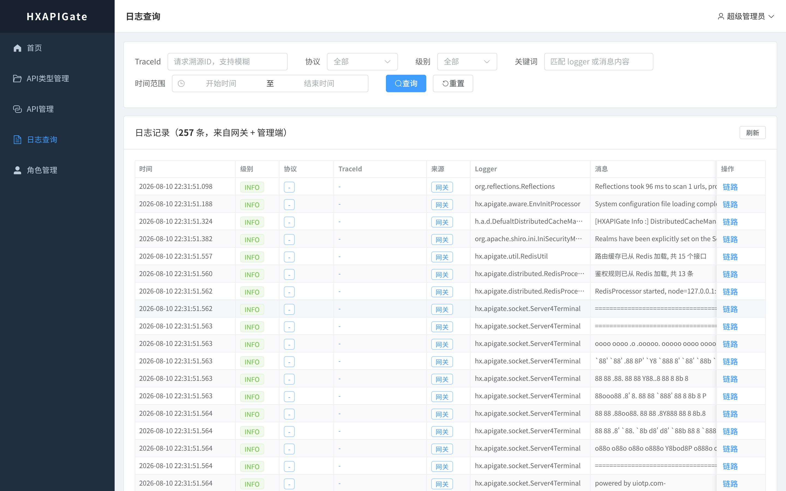

# HXAPIGate（浩心 API 网关）—— 零侵入式高性能 API 网关

> 基于 **Netty + Shiro** 开发的高性能零侵入式 API 网关（被代理微服务**不需要添加任何代码或注解**），适用于 REST 微服务的 **API 资源细粒度授权管理**，支持 HTTP / Dubbo / MCP / WebSocket 多协议代理。

[](https://BrianApple.github.io/docs/hxapigate/intro)
[](https://gitee.com/willbeahero/HXAPIGate)


---

## ✨ 核心功能

| 能力 | 说明 |
|---|---|
| **细粒度授权** | 「**API 资源 + 请求方式**」组合授权：同一路径 `/user/list` 的 GET/POST/DELETE/PUT 可分别授权，仅授权 GET 时无法访问其他方式 |
| **多协议代理** | HTTP / Dubbo / **MCP** / **WebSocket** 四种协议代理（MCP 支持透传与 HTTP 映射两种模式） |
| **MCP 协议转换** | 模式①：MCP 原样透传；模式②：普通 REST 接口**零改造**暴露为 MCP 工具，供 AI 客户端（Claude Desktop/Cursor 等）调用 |
| **WebSocket 双向透传** | 双向帧透传、后端主动推送、断开传播、可配置空闲超时（`HXAPI_WS_IDLE_TIMEOUT`，默认 60s） |
| **文件上传/下载代理** | multipart 报文无损透传（实测 15MB），大小限制可配（`HXAPI_MAX_CONTENT_LENGTH`，默认 16MB） |
| **分布式治理** | Redis 分布式限流（计数信号量）、接口熔断（状态机，配置值优先 TPS 自动推导）、负载均衡（轮询/随机/权重/TPS）、金丝雀发布 |
| **安全体系** | JWT 认证（密钥环境变量外置）、Shiro 授权、应用 JWT License（90 天轮换建议、吊销即时失效） |
| **日志溯源** | 全链路 traceId（`X-Trace-Id` 头可传自定义 ID）+ 协议标识，管理平台日志可视化检索 |

## 🎯 项目价值

- **真正的零侵入**：被代理微服务无需添加任何代码/注解/依赖，发布后网关即赋予分布式特性（对比 Spring Cloud 全家桶 / Dubbo 的高改造成本）
- **MECHA 机甲思想**：把分布式能力（限流/熔断/负载/鉴权）从业务服务中剥离到网关侧，微服务只关心业务
- **存量系统友好**：历史遗留系统无需改造即可获得分布式能力，是 SpringCloud/Dubbo 的轻量替代
- **性能**：2000 并发事务压测通过（jdk1.8，堆内存 512M）
- **生产级功能**：接口熔断 UI 可视化配置、日志 90 天滚动保留、网关核心单元测试（14 用例全通过）

## 📸 截图

| 登录页 | 接口管理 |
|---|---|
|  |  |

| 日志查询（链路追踪） | 授权管理（角色资源授权） |
|---|---|
|  |  |

## 🚀 快速开始

```bash
# 环境：JDK 21、MySQL（默认 127.0.0.1:13306，库 hxapigate）、Redis（默认 127.0.0.1:6379）

# 0. 初始化数据库（首次必做，含测试数据）
mysql -uroot -p < HXBootShiro/hxapigate.sql

# 1. 启动管理端（HXBootShiro）
mvn -f HXBootShiro/pom.xml package -DskipTests
./start_bootshiro.sh

# 2. 启动网关（HXAPIGate，启动后自动从 Redis 拉取路由配置）
mvn -f HXAPIGate/pom.xml package -DskipTests
./start_gateway.sh
```

| 服务 | 地址 |
|---|---|
| 管理平台（Web 控制台） | http://localhost:18080/static/index.html |
| API 网关（透传入口） | http://localhost:18081 |

测试账号：`admin / admin123`（另有 testuser、user02，见文档）

## 📚 详细文档（文档站）

完整教程已迁移至文档站，**后续文档更新以文档站为核心**：

| 文档 | 链接 |
|---|---|
| 产品介绍 | https://BrianApple.github.io/docs/hxapigate/intro |
| 快速开始 | https://BrianApple.github.io/docs/hxapigate/quickstart |
| 授权认证 | https://BrianApple.github.io/docs/hxapigate/auth |
| 配置说明 | https://BrianApple.github.io/docs/hxapigate/config |
| 高级特性（MCP/WebSocket/文件代理/熔断限流） | https://BrianApple.github.io/docs/hxapigate/features |

## 📌 项目进度

- API 接口管理基本开发完成，后续主要扩展代理协议与网关功能
- 已完成一轮安全加固与质量优化：JWT 密钥/数据库口令环境变量化、死代码清理、网关核心单测、熔断配置 UI 全链路打通

## 🔗 生态与链接

- **物联网关**：IOTGate —— https://gitee.com/willbeahero/IOTGate
- **GitHub 镜像**：https://github.com/BrianApple/HXAPIGate
- **开源文档站**：https://BrianApple.github.io （全部产品教程）
- **相关博文**：
  - [HXAPIGate系列——快速入门](https://blog.csdn.net/sinat_28771747/article/details/126610401)
  - [《netty整合shiro,报There is no session with id [xxxxxx]问题定位及解决》](https://blog.csdn.net/sinat_28771747/article/details/105245229)

## 🙏 感谢

Netty、Shiro、Dubbo、Ignite、bootshiro 等开源项目及其作者。
